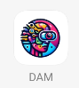

# DAM

La iniciativa surge con el propósito de elevar la accesibilidad y mejorar la calidad de vida de
las personas con discapacidad visual. Este sector de la población enfrenta desafíos continuos
para acceder a información visual que para muchos es rutinaria. Desde la navegación en
entornos públicos hasta la identificación de objetos cotidianos, la falta de acceso a la
información visual puede restringir su autonomía y participación en la sociedad. La
aplicación que se propone tiene como meta brindar una herramienta que les permita
comprender su entorno, reconocer objetos, desplazarse por distintos lugares y llevar a cabo
otras actividades diarias de manera más independiente y eficiente.
## Metodología


Para llevar a cabo esta iniciativa se conformó un equipo de desarrollo de 5 integrantes bajo la
metodología ágil scrum, esto por qué permite un desarrollo continuo y rápido, donde se puede
recibir una retroalimentación constante por parte del cliente y del equipo de desarrollo en lo
que respecta al proyecto, teniendo como cliente al docente oscar bedoya autor de la idea qué
se hizo código en este proyecto.
Se realizó una matriz de riesgo para evaluar todos los posibles riesgos con impactos positivos
como negativos, esto con el fin de tener una mejor planeación además de un plan en caso de
incurrir en algún riesgo a lo largo del proyecto.
Se plantearon 4 Sprint con una duración de 2 semanas por sprint, en los cuales se trazaron las
tareas por cumplir en cada uno de estos repartiéndose a cada desarrollador del equipo. Se
realizó una reunión semanal para comentar avances o dificultades en el desarrollo de las
tareas asignadas, además de realizar retrospectivas tras la finalización del sprint, optando en
este último por el modelo de las 4L
## Equipo

- **Scrum Master:** Karen Moreno
- **Product Owner:** Brayan Acuña
- **Desarrolladores:**
  - Lina Marcela
  - Juan Castillo
  - Víctor Ñáñez
## APLICACION



## Requisitos Previos

Antes de comenzar, asegúrate de tener instalados los siguientes requisitos:

- [Git](https://git-scm.com/)
- [Visual Studio Code](https://code.visualstudio.com/)
- [Flutter](https://flutter.dev/docs/get-started/install)

## Instalación

Sigue los pasos a continuación para configurar y ejecutar la aplicación DAM.

### 1. Clonar el Repositorio

Primero, clona el repositorio de GitHub en tu máquina local:

```bash
git clone https://github.com/Gestion-de-proyecto/dam.git
cd DAM

### Configurar Flutter
Asegúrate de tener Flutter instalado y configurado en tu máquina. Si no lo has hecho, sigue las instrucciones oficiales de Flutter para instalarlo.
Verifica que Flutter esté correctamente instalado ejecutando:
bash
Copiar código
flutter doctor
